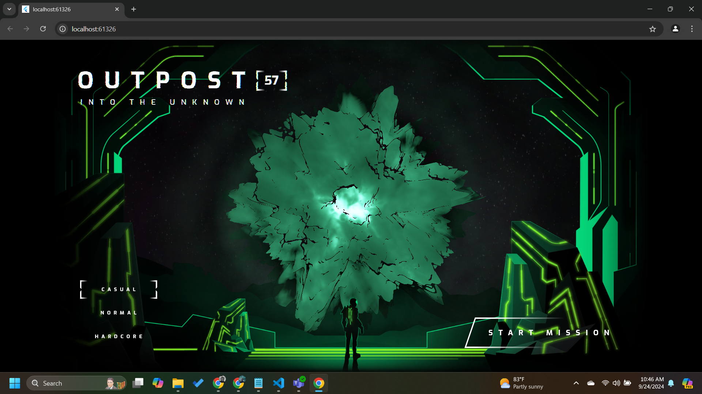

# next-gen-ui 
I implemented a Google codelab, a full-featured game intro screen with animations, fragment shaders, and particle animations!

## Key Concepts Learnt
- Animations
- Fragment shaders
- Particle animations

[Check out the codelab here.](https://codelabs.developers.google.com/codelabs/flutter-next-gen-uis#0)
 
 
 
 
